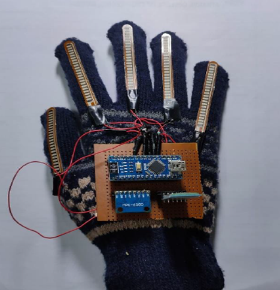

A Sign to text-speech system developed using Arduino Nano, Flex Sensors, Accelerometer (MPU6050) and HC-05 (Bluetooth Module). 
The Arduino Nano was programmed using the Arduino IDE and was used to make the system compact then the traditional systems built using Arduino UNO.

Publication: http://www.journal-iiie-india.com/1_apr_24/9.6_apr.pdf

Circuit Diagram of the System:

   
   
Prototype:

